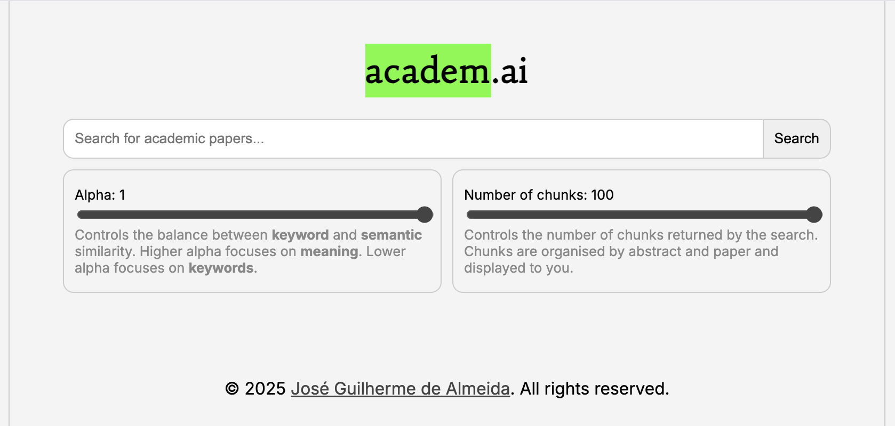
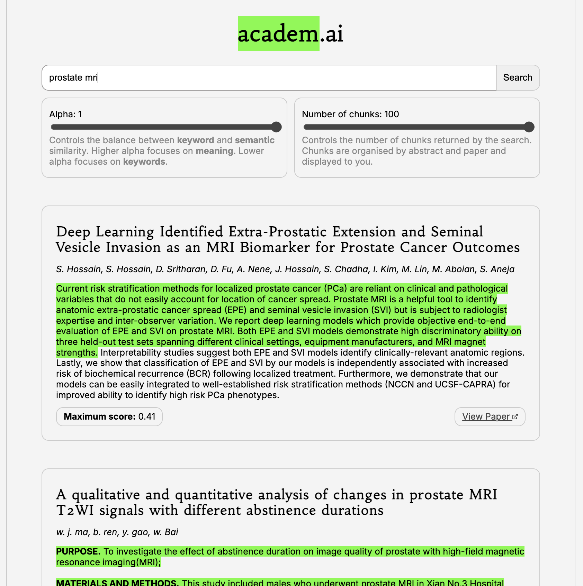
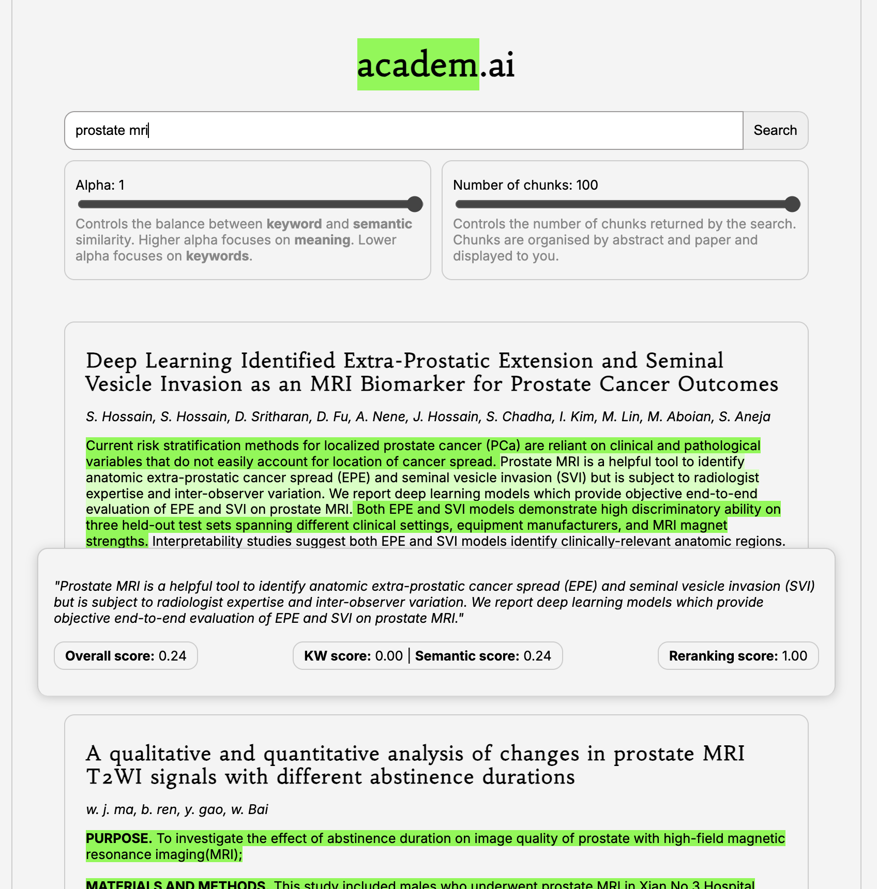

# Implementing local retrieval system for academic papers

## Context

An issue which a lot of researchers run into are the relatively outdated search engines powering academic manuscript databases. I felt a bit frustrated with how the relatively poor support for semantic searchers: oftentimes, I got stuck having to think of the ideal keywords to retrieve the papers I was looking for. On the other hand, popular search engines have widely adopted everything related to semantic search (the comically subpar "AI summaries" will remain undiscussed here).

While this is perhaps not something that a lot of people contend with, the usual academic manuscript search rests on a core principle: exactness. If people conduct a proper meta-analysis or meta-review, they will oftentimes post long, intractable queries which are understood by search engines but which can be relatively hard to comprehend. Words can be, for better or worse, both polysemous - where the same word refers to multiple things - and synonymous - where the same thing can be referred to by multiple words. This means that queries have to be highly sensitive (they have to retrieve all papers related to a given field) but also specific (they have to filter out as many unrelated papers as possible).

### Thinking about retrieval

With this in mind I started thinking - can this be improved?

**Manual query construction** can be quite time-consuming and error-prone. I remember reviewing some meta-analysis papers which missed key papers because they did not think about specific keywords. Some improvements can be considered: preprocessing words and reducing them to their stems (think of the word "running" and "runs" - they are both reduced to "run") or enriching the query with synonyms. However, we once again run into the issue of exactness as this changes the sensitivity and specificity of our run.

I have toyed with **automatic query generation** using LLMs and this works to a good extent. In other words, you can use an LLM to construt queries which can be used by your favourite search engine using a mixture of clever prompting and structured outputs for parsing at a later stage. However, this still relies on some form of exactness which is hard to verify. Different and shifting word meanings can have an impact on how capable LLMs are of building these sorts of queries.

We can also consider approaches which first retrieve a very high number of results (high sensitivity) and perform some metadata-based filtering to increase the specificity. However, this is just an iteration of query generation or construction, with or without filters.

One of the features I enjoy the most about **modern chatbots** is their ability to search the web. What they do is fairly simple and is, essentially, an iteration of tool use with **automatic query generation**. A search is triggered because the chatbot predicts that its knowledge base is insufficient to provide an accurate answer to the user's message, which is converted into a search query. The digestion that happens afterwards, where the relevant information is extracted, is really the best part as it provides some structure to the chatbot's output. Now, don't get me wrong - this summarization feature is not the most accurate, but it helps me filter through the clutter of web search results.

Other recent methods also include the **automatic extraction of metadata** from documents or webpages to facilitate search - however, this is also hindered by having to specify the metadata fields to extract, which can change with time.

The ideal would be a method which can take characterise the _meaning_ of a query and retrieve relevant documents to it. This is what **semantic search** is all about.

### It's all semantics (non-derogatory)

Generally, the whole point of **retrieval** is to produce a set of results which are related to a given query. In other words, a good set of results is characterised by proximity to the query in terms of meaning, not exactness. This is where **semantic search** comes in.

Semantic search - as it is performed currently - usually uses a natural language processing (NLP) model to quantify a sentence or document as a vector (which can also be referred to as an embedding). This vector should represent (using typically a large number of dimensions) the meaning of that sentence or document. This means that two semantically similar but distinct phrases - "the queen of England" and "the monarch of the United Kingdom" - should yield similar vectors. [^1]

[^1]: of course that there are systematic biases plaguing these vectors. We've known this since [2017](https://www.science.org/content/article/even-artificial-intelligence-can-acquire-biases-against-race-and-gender), and more [recent NLP models](https://aclanthology.org/2022.gebnlp-1.20/) or [large language models](https://dl.acm.org/doi/fullHtml/10.1145/3582269.3615599) tend to suffer from the same issues. Biased data is biased data is biased data, no matter the algorithm.

The options to compute embeddings are manifold and generally involve generating one embedding for each token (which typically corresponds to a word or to a part of a word). The simpler options are models similar to [BERT](https://research.google/blog/open-sourcing-bert-state-of-the-art-pre-training-for-natural-language-processing/), which use a model training paradigm combining masked word prediction (a word at random is masked and predicted from the rest of the sentence) with next sentence prediction (the model predicts whether a given sentence is the next sentence in a document) to guarantee both grammatical and semantic coherence. Other popular methods include [ColBERT](https://arxiv.org/abs/2004.12832) - which is similar to BERT but uses a different training paradigm where the model is trained to retrieve the best matching tokens or words from query and document embeddings - and any old LLM which can be used to generate embeddings for a set of tokens. These models yield one embedding for each token. These are aggregated in some way (average or maximum pooling, classification tokens) to yield a single query/sentence/document embedding.

On top of this, exact matching (or a [variation](https://www.geeksforgeeks.org/nlp/what-is-bm25-best-matching-25-algorithm/)) can still be used - the combination of multiple retrieval methods is typically referred to as "hybrid" search, and most search engines tend towards hybrid searches. While somewhat odd, it starts to make sense once you realise that a lot of people (myself included) use search terms in a relatively telegraphic manner: if I want to search for papers on caffeine's impact on the onset of Alzheimer's disease, I will simply type "caffeine alzheimer's onset". Combining both exact matching and semantic search can yield a search that feels more natural and that better works for everyone.

## Implementing a local retrieval system

**Note:** all of this is somewhat similar to what Semantic Scholar does through their API services - I am not sure how their search functionalities work, but I would assume they rely on keyword matching with some minimal amount of semantic search. What I present below is, in essence, the hacker's version of that with fewer resources/papers. In any case this is scalable using the [Semantic Scholar data API](https://www.semanticscholar.org/product/api/tutorial).

### 1. Getting the data

To implement a local retrieval system for academic literature search, we first need to get a hold of a dataset of academic abstracts. Luckily, both [bioRxiv](https://www.biorxiv.org/) and [medRxiv](https://www.medrxiv.org/) have very handy APIs for this. Using programmatic access and some minimal parallelization, we can retrieve a large number of abstracts in a matter of minutes. I stored these in a [SQLite](https://sqlite.org/index.html) database so everything is standardised.

### 2. Embedding the data

This is the time consuming bit. I quite like the [HuggingFace](https://huggingface.co/) stack with [SentenceTransformers](https://www.sbert.net/), so I used that for embedding my abstract chunks (sentences or pieces of the abstracts). Given that I am running all of this locally and that I don't have a GPU, I used a[really small model](https://huggingface.co/sentence-transformers/all-MiniLM-L6-v2) for this. For the embedding database/retrieval workhorse I made use of [Weaviate](https://weaviate.io/), a pretty powerful solution that is open source and guarantees fast retrieval while also supporting multiple types of search and metadata filtering.

I defined two separate databases (or collections): one for abstracts and the other for abstract chunks. This allowed me to have databases which are less disk space-intensive while guaranteeing that I can retrieve the chunks I need. These chunks are cross-referenced to their abstracts, so it is really easy to retrieve the abstracts corresponding to the chunks.

### 3. Defining an API

The simplest API I could define was one with three endpoints:

1. `/health` - a simple health check endpoint
2. `/query` - a search endpoint which takes a query and returns a structured list of relevant abstract chunks
3. `/count` - a count endpoint which takes a query and returns the number of relevant abstract chunks by source (i.e. `medrxiv` or `biorxiv`)

The technical stack here is very classic if you are used to Python - [FastAPI](https://fastapi.tiangolo.com/) and [Pydantic](https://pydantic-docs.helpmanual.io/) for data models.

### 4. Re-ranking results

Before we can display the results to the user, we need to re-rank them. While semantic search tends to work well for the general task of retrieving similar results, distances are not always a good proxy for relevance. This is where result re-ranking comes into play: using a set of models known as cross-encoders, which produce a similarity score for two queries (in this case, the abstract chunk and the user's query), we can re-rank the results based on actual similarity to the query.

Once again, SentenceTransformers came to the rescue - this time with [a really small cross-encoder model](https://huggingface.co/cross-encoder/ms-marco-TinyBERT-L2-v2).

### 5. Making a pretty thing

I am a fan of some minimal web development, so I coded a small frontend using the classic HTML/CSS/JS stack. I know the cool kids are all using React and Tailwind, but it would be an overkill for such a small project. Plus, if it becomes a necessity I can always switch to a more modern stack.

## Using a local retrieval system

Given that these are, in essence, a small set of micro-services, there are good solutions to ensure reproducibility. For now, I packaged everything as a Docker compose recipe with two custom images: one constructing the embedding database and running the API, the other running the frontend.

The final result is a relatively simple interface with a clean, minimalistic design.

To give it the look and feel of that ages-old friend of the academic - the green marker - I used green highlights to capture relevant passages.

Hover states highlight the passages which were retrieved from the embedding database, as well as their relative scores in terms of semantic similarity, keyword (exact search) similarity, and normalised reranking score.

Seeing everything in action feels pretty smooth - this is a search over nearly 1,000,000 chunks over a little under 100,000 papers in a matter of seconds. Having options over the search parameters is pretty useful - knowing how many results should be retrieved and the relative weights for the semantic and keyword search gives users a finer grained control over the results.

<video src="assets/1.mp4" controls /></video>

## Explaining some choices

### Vector database

### Embedding and reranking models

### API
